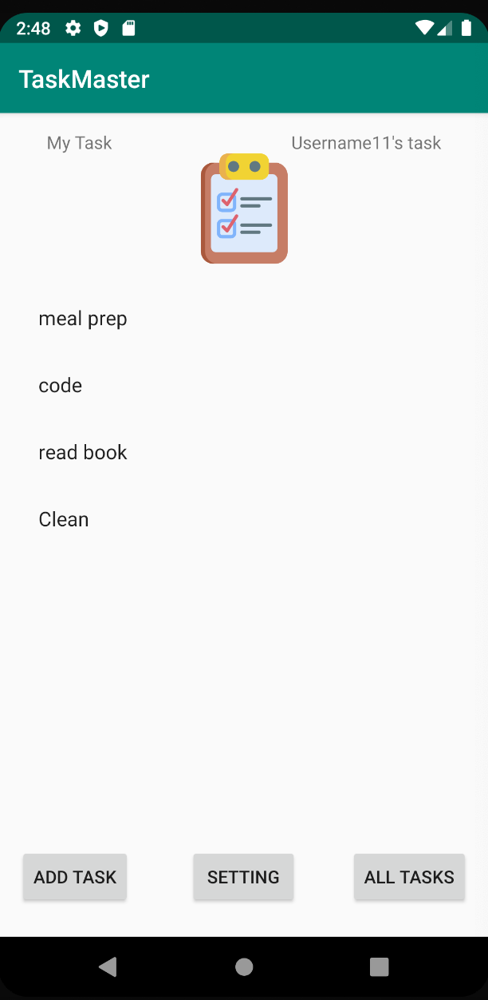
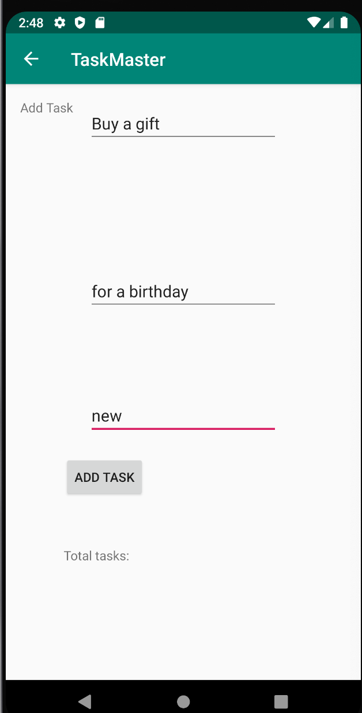
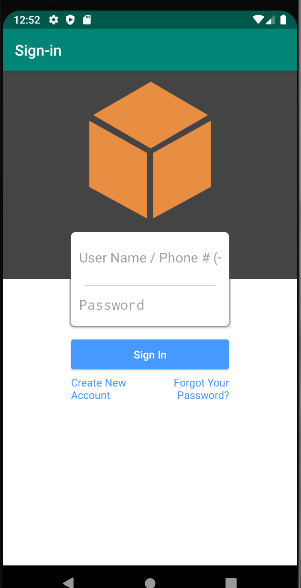
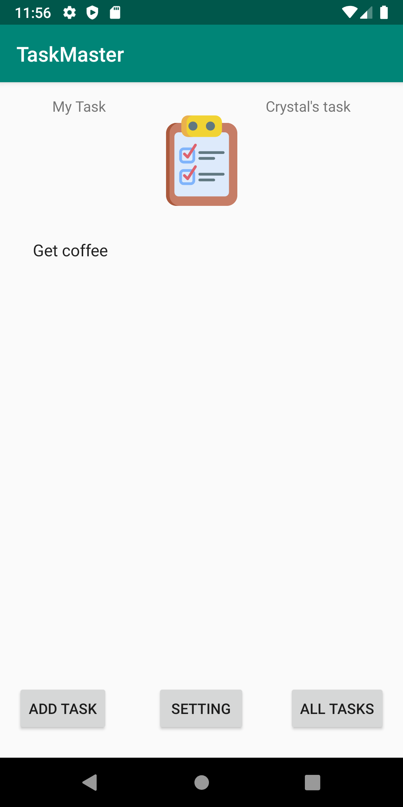
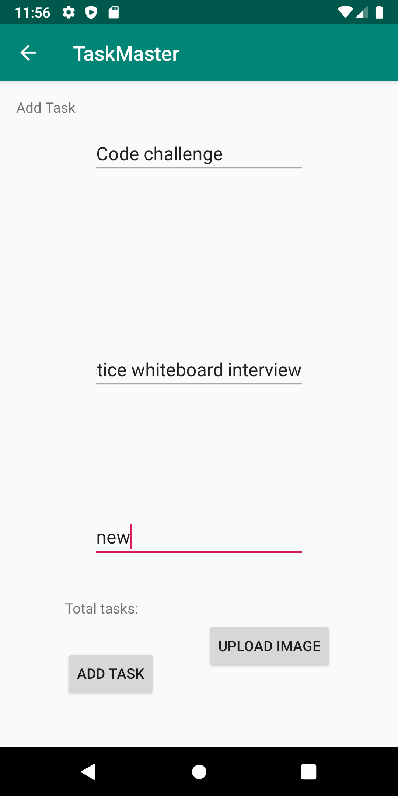

# TaskMaster

## Lab 26: Beginning TaskMaster
### ***Feature Tasks***
1. Homepage

- The main page should be built out to match the wireframe. In particular, it should have a heading at the top of the page, an image to mock the “my tasks” view, and buttons at the bottom of the page to allow going to the “add tasks” and “all tasks” page.

2. Add a Task

- On the “Add a Task” page, allow users to type in details about a new task, specifically a title and a body. When users click the “submit” button, show a “submitted!” label on the page.

3. All Tasks

- The all tasks page should just be an image with a back button; it needs no functionality.

***

# TaskMaster

## Lab: 27 - Data in TaskMaster
### ***Feature Tasks***
1. Task Detail Page

- Create a Task Detail page. It should have a title at the top of the page, and a Lorem Ipsum description.

2. Settings Page

- Create a Settings page. It should allow users to enter their username and hit save.

3. Homepage

- The main page should be modified to contain three different buttons with hardcoded task titles. When a user taps one of the titles, it should go to the Task Detail page, and the title at the top of the page should match the task title that was tapped on the previous page.
- The homepage should also contain a button to visit the Settings page, and once the user has entered their username, it should display “{username}’s tasks” above the three task buttons.

***

# TaskMaster

## Lab 28: RecyclerViews for Displaying Lists of Data
### ***Feature Tasks***
1. Task Model
- Create a Task class. A Task should have a title, a body, and a state. The state should be one of “new”, “assigned”, “in progress”, or “complete”.

2. Homepage

- Refactor your homepage to use a RecyclerView for displaying Task data. This should have hardcoded Task data for now.
- Some steps you will likely want to take to accomplish this:

- Create a ViewAdapter class that displays data from a list of Tasks.
- In your MainActivity, create at least three hardcoded Task instances and use those to populate your RecyclerView/ViewAdapter.

- Ensure that you can tap on any one of the Tasks in the RecyclerView, and it will appropriately launch the detail page with the correct Task title displayed.

***

# TaskMaster

## Lab 29: Saving Data with Room
### ***Feature Tasks***
1. Task Model and Room
Following the directions provided in the Android documentation, set up Room in your application, and modify your Task class to be an Entity.

2. Add Task Form
Modify your Add Task form to save the data entered in as a Task in your local database.

3. Homepage
Refactor your homepage’s RecyclerView to display all Task entities in your database.

4. Detail Page
Ensure that the description and status of a tapped task are also displayed on the detail page, in addition to the title.(Note that you  can accomplish this by passing along the entire Task entity, or by passing along only its ID in the intent.)

***

# TaskMaster

## Lab 33: Polish and add All Tasks Page
### ***Feature Tasks***
App will add a new activity for all tasks with a Recycler View showing all tasks. These tasks must be clickable. When clicked on, trigger a Toast that displays details about the task.

***

# TaskMaster

## Lab: 34 - Amplify and DynamoDB
### ***Feature Tasks***
1. Tasks Are Cloudy
Using the amplify add api command, create a Task resource that replicates our existing Task schema. Update all references to the Task data to instead use AWS Amplify to access your data in DynamoDB instead of in Room.

2. Add Task Form
Modify your Add Task form to save the data entered in as a Task to DynamoDB.

3. Homepage
Refactor your homepage’s RecyclerView to display all Task entities in DynamoDB.

***

# TaskMaster

## Lab 36: Adding Cognito
### ***Feature Tasks***
1. User Login
Add Cognito to your Amplify setup. Add in user login and sign up flows to your application, using Cognito’s pre-built UI as appropriate. Display the logged in user’s username somewhere relevant in your app.

2. User Logout
Allow users to log out of your application.

***

# TaskMaster

## Lab 37: S3 Uploads
### ***Feature Tasks***
1. Uploads
On the “Add a Task” activity, allow users to optionally select a file to attach to that task. If a user attaches a file to a task, that file should be uploaded to S3, and associated with that task.

2. Displaying Files
On the Task detail activity, if there is a file that is an image associated with a particular Task, that image should be displayed within that activity. (If the file is any other type, you should display a link to it.)

***

# TaskMaster

## Lab: 40 - Notifications
### ***Feature Tasks***
1. Notifications on Task Creation
When a new task is created within a team, alert all users who are a part of that team about that new task.

***

# TaskMaster

## Lab 41: Intent Filters
### ***Feature Tasks***
1. Adding a Task from Another Application
Add an intent filter to your application such that a user can hit the “share” button on an image in another application, choose TaskMaster as the app to share that image with, and be taken directly to the Add a Task activity with that image pre-selected.

***